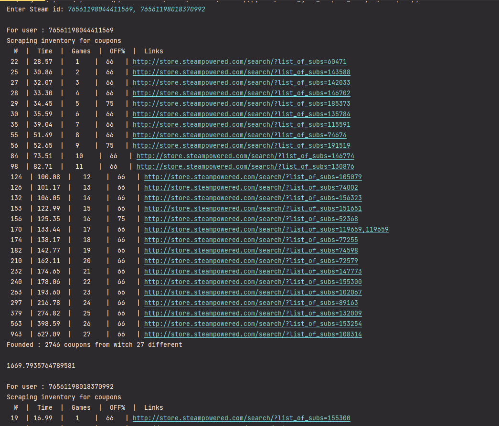

# Steam game coupons scraper
### Requirement imports
- #### requests   
- #### json   
- #### re   
- #### time

Recently I start buying cheap steam games so that I can get steam badge for owning games  
But it was taking me way to long to check manually all the coupon bots.   
So I have created this script to do the work for me. It still has some futures missing like:
- #### Parallel price checking
- #### Filtering out user owned games
- #### Getting the whole inventory  
- #### User GUI

You can scrape both a single inventory or list of inventories (must be SteamID).  
For multiple inventories the SteamID must be separated by ', ' (comma and space)

You can change both the pricing range and the coupon discount in side of the code.  
By Default the script gets you game that are priced under '1 €' so if you live in country where you got regional pricing for steam  
Like:(Rus, TR, AR, BR)  
For the discounts It is searching for more then 66%.  
Only games with trading cards will be showing you can remove the filter in the code.  
- by commenting out the ( + f'&category2=29')

From my test the inventory in steam shows that it has more then 3,177 items, but as you can see it has gone through only 2,746 results  t
and it took half an hour

Under the code I have left 3 inventories. If you got other coupon bots you can DM in
[Steam](https://steamcommunity.com/profiles/76561198145230280) 
or here 
